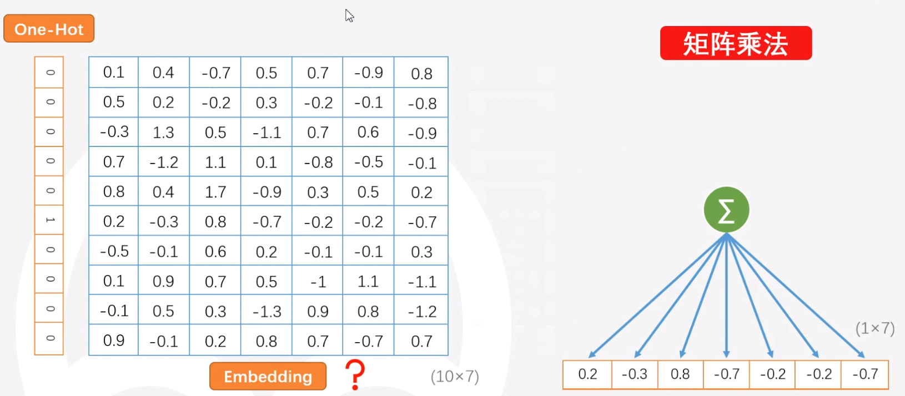

# 1、语言的表示：
* 单个文字的表示：
    * 字典方式
    * one_hot编码：
        * 1、稀疏  
        * 2、文字互相正交
        
    * word2vec:
        * 对文字one_hot编码后，训练Embedding矩阵，矩阵相乘可得文字的嵌入式编码。
    * 静态语言模型
        * 如何得到Embedding矩阵，如何定义字义，具有相近字义的文字，其上下文的字的分布，常见的编码方式如下：
            * GloVe（Global Vectors for Word Representation）[glove文论地址](https://aclanthology.org/D14-1162.pdf)
                * 统计共现矩阵->平滑处理->矩阵分解（降维） 
            * N-Gram
                * 统计条件概率分布->平滑处理->降维
            * Word2Vec
                * 中心字预测上下文
                * 上下文预测中心字
    * 动态语言模型
        * 如，如果一个人拥有语言表达的能力，那么他一定会__的任务，
        * 方法：
            * 给出上文，续写下文
            * 完型填空 
            * 给出两个句子判断是否来源于同一文章 
            * 给出两个句子判断他们的前后顺序
        * 模型
            * GPT
            * ELMo
            * BERT
        *  Transformer
            * 嵌入处理（最终嵌入=token嵌入+位置嵌入+句标嵌入）
                * token嵌入矩阵
                * 位置嵌入矩阵
                    * 绝对性
                        * 
                    * 相对性
                    * 有界性
                * 句标嵌入矩阵
            *结构 
                * Transformer Multi-head Attention(多头注意力机制）
                    * Atention
                        * 
                * Add & Norm
                    * LayerNorm(R+O)
                * Feed Forward
                    * 
            * 
         
        
    
# 2、命名实体识别（NER）

# 3、实体关系抽取（NRE）

# 4、图搜索引擎

# 附：数据标注与标注管理

# 感谢：
    众阳健康科技的张伯政的直播演讲，此笔记旨在记录此直播，并整理对这个技术的学习。  
    [glove参考文章](https://www.jianshu.com/p/6b74f77c05e3)

